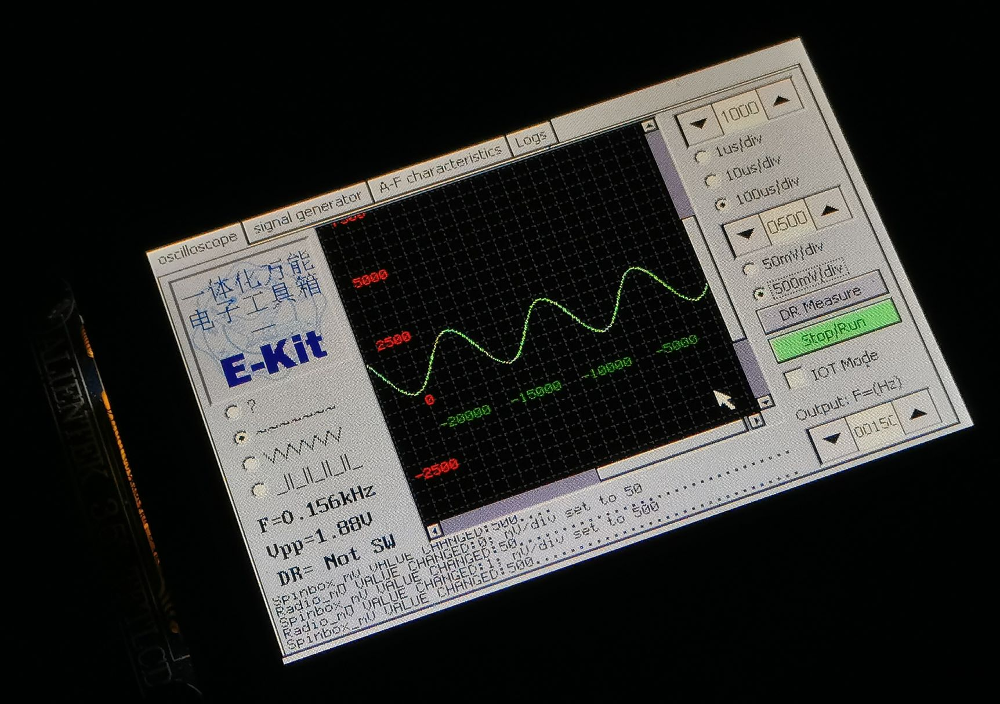
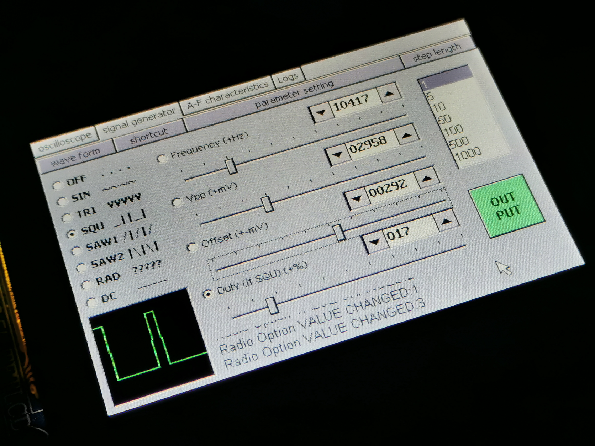
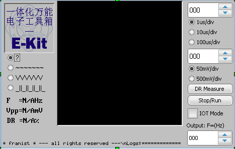
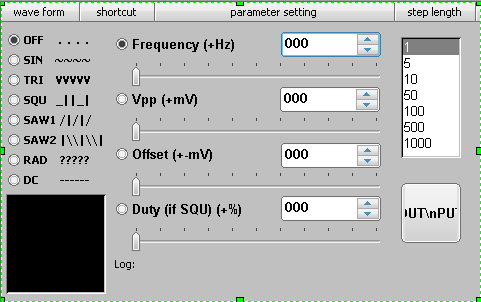
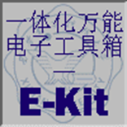

# E-kit

E-kit 一体化电子工具箱，STM32实现，示波器+函数发生器+...

## 基本功能 

* STM32F103 (停留在较旧的版本并停止更新，仅支持以下功能)

- [x] 基本示波器实现（包括波形判断，频率测量，峰峰值测量，占空比测量）
- [x] 任意频率正弦波输出
- [x] 多窗口支持
- [x] 集中式Log

* STM32F407

- [x] 基本示波器实现（包括波形判断，频率测量，峰峰值测量，占空比测量）

- [x] 任意频率正弦波输出

- [x] 多窗口支持

- [x] 集中式Log

- [ ] 幅频特性仪移植

- [ ] 上位机通讯重构

- [x] 函数信号发生器

- [ ] 示波器触发模式

- [ ] 电池管理

  

## UI

## 外置电路

## 一些经验

移植cube-MX生成的工程时注意`stm32f4xx_it.c `文件也会生成一些代码

---

目前此仓库仅适合个人参考，但每次提交的工程都确保已实现部分能用

注意：采用GB2312编码

