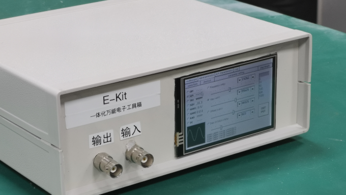

<div align="center">
  
</div>


# E-kit

E-kit 一体化电子工具箱，STM32 实现，示波器 + 函数发生器 + 幅频特性仪器...




*目前此项目已归档*

*注意：工程采用 GB2312 编码*

## 基本功能 

- STM32F103 (停留在较旧的版本并停止更新，仅支持以下功能)
  - [x] 基本示波器实现（包括波形判断，频率测量，峰峰值测量，占空比测量）
  - [x] 任意频率正弦波输出
  - [x] 多窗口支持
  - [x] 集中式 Log
- STM32F407
  - [x] 基本示波器实现（包括波形判断，频率测量，峰峰值测量，占空比测量）
  - [x] 任意频率正弦波输出
  - [x] 多窗口支持
  - [x] 集中式 Log
  - [x] 幅频特性仪移植
  - [ ] 上位机通讯重构
  - [x] 函数信号发生器
  - [ ] 示波器触发模式
  - [ ] 电池管理


# 设计文档

## 一、工作原理

### 1. 软件部分

采用 HAL 库支持的 C 语言程序实现，通过无操作系统的形式直接运行在 ARM 架构 STM32F407 单片机上。通过 ARM Cortex M4 额外支持的硬件 FPU、DSP 指令集，更快的 FSMC，给予程序更高的运行效率、数据处理效率以及更高的显示速度。

程序流程通过初始化 + 主循环的结果，GUI 交互回调相应的模式。稳定性好。显示方案采用 STemWin 图形库实现，并支持电阻屏触摸，自己移植的图形库配合 HAL 库的框架工程开源在[framist/STemWinForHAL: 移植 emWin 与 HAL 库结合。（正点原子项目结构） (github.com)](https://github.com/framist/STemWinForHAL)。

项目工程已开源在 [framist/E-kit: E-kit 一体化电子工具箱 (github.com)](https://github.com/framist/E-kit)

总体使用到的版级接口：

```
TFTLCD <--排线--> TFTLCD(>=3.5')

VREF  <-跳线帽-- 3.3V

PA5  <-------- adc 输入

PA4  --------> dac 输出
```

#### 1.1 示波器部分


通过通用定时器 TIM5 定时中断，控制 ADC 按精准的时间间隔取样。

采用 DSP 库中的 FFT 算法得出频率，作为后续处理的前提参考。微分法首先判别是否为方波，积分法判断波形和测占空比，同时还能实时测量信号的峰峰值、偏置电压等等。 

示波器还采用自动量程。通过当前计算的波形频率自动调整 ADC 的采样周期，已适应更大的频率范围

 

#### 1.2 信号发生器部分

使用 DMA 的方法把内存中的波形数据依次传递到 DAC 控制器，基本定时器 TIM6 控制 DMA 的速度来控制输出波形的频率。

通过软件控制波形、峰峰值、偏置电压、占空比。

DAC 输出 0~3.3V 的电平信号再经过外围电路的转换得到 -5V 到 +5V 范围的信号并进行输出。


#### 1.3 幅频特性仪部分

比较输入输出信号的峰峰值可以计算得出滤波器的增益，

通过扫频的方式连续测量可以绘制出未知滤波器的幅频特性曲线。

通过幅频特性曲线可以判别出滤波器的类型，目前可自动判别以下几种类型的滤波器：

0：低通 HPF 1：高通 LPF 2：带通 BPF 3：带阻 BRF 


#### 1.4 IOT 上位机部分

蓝牙串口透传模块实现。可转换实现与上位机的无线信号传输。

通过其他各种数据分析软件，我们可以同步在上位机观察波形并进行数据分析


### 2. 硬件部分


#### 2.1 电源部分

2.1.USB   接口模块部分 

2.1.2   充电蓄电模块部分 

2.1.3   负压生成部分 

 

#### 2.2 扩幅电路部分

2.2.2   信号输入部分 

2.2.2   信号输出部分 

 

##  二、仪器制作过程 

###  1.   软件部分

####  1.1   主函数部分 

主函数主要实现 init 与 main loop。

####  1.2   屏幕部分 

屏幕采用 3.5' TFTLCD 作显示，并可作为电阻屏输入触摸，支持手写笔。

1.2.1 初始化

 

先生成一个主窗口框架 mainFramewin，再在此窗口框架中通过 Multipage 窗口小组件生成四页选项卡，每页分别包含一个窗口。

```c
hItem = WM_GetDialogItem(pMsg->hWin, ID_MULTIPAGE_0);
MULTIPAGE_AddEmptyPage(hItem, 0, " oscilloscope ");
MULTIPAGE_AddEmptyPage(hItem, 0, " signal generator ");
MULTIPAGE_AddEmptyPage(hItem, 0, " A-F characteristics ");
MULTIPAGE_AddEmptyPage(hItem, 0, " Logs ");

WM_HWIN CreateoscilloscopeFramewin(void);
hWin_oscilloscopeFramewin = CreateoscilloscopeFramewin(); 
MULTIPAGE_AttachWindow(hItem,0,hWin_oscilloscopeFramewin);

WM_HWIN CreateSingalWindow(void);
hWin_SingalWindow = CreateSingalWindow();
MULTIPAGE_AttachWindow(hItem,1,hWin_SingalWindow);

WM_HWIN CreateAFCFramewin(void);
hWin_AFCFramewin = CreateAFCFramewin();
MULTIPAGE_AttachWindow(hItem,2,hWin_AFCFramewin);

WM_HWIN CreateLogWindow(void);
hWin_LogFramewin = CreateLogWindow();
MULTIPAGE_AttachWindow(hItem,3,hWin_LogFramewin);

MULTIPAGE_SelectPage(hItem,0);
```


1.2.2 图形界面

按功能分别包含 4 个子窗口，功能分别作示波器、波形发生器、幅频特性测试仪、系统日志的窗口：


日志窗口只是一个输出日志的文本框。


#### 1.3 信号获取与处理部分

 

1.3.1 ADC 获取数据


1.3.2 FFT 处理数据

> STM32F4 采用 Cortex-M4 内核，相比 Cortex-M3 系列除了内置硬件 FPU 单元，在数字信号处理方面还增加了 DSP 指令集，支持诸如单周期乘加指令（MAC），优化的单指令多数据指令（SIMD），饱和算数等多种数字信号处理指令集。相比 Cortex-M3，Cortex-M4 在数字信号处 理能力方面得到了大大的提升。Cortex-M4 执行所有的 DSP 指令集都可以在单周期内完成，而 Cortex-M3 需要多个指令和多个周期才能完成同样的功能。

主要采用

```c
void arm_cfft_radix4_f32(
    const arm_cfft_radix4_instance_f32 * S,
    float32_t * pSrc);
void arm_cmplx_mag_f32(
    float32_t * pSrc,
    float32_t * pDst,
    uint32_t numSamples);
```


完成 FFT 计算。（但主要这两个函数目前不再推荐使用）

主要程序结构如下：

```c
float wave_frequency_calculate(void)
{
    //初始化 scfft 结构体，设定 FFT 相关参数
    arm_cfft_radix4_instance_f32 scfft;
    arm_cfft_radix4_init_f32(&scfft,FFT_LENGTH,0,1); // TODO 不知道加上按位取反的原理
    //FFT 计算（基 4）
    arm_cfft_radix4_f32(&scfft,fft_inputbuf);	
    //把运算结果复数求模得幅值 
    arm_cmplx_mag_f32(fft_inputbuf,fft_outputbuf,FFT_LENGTH);	

    uint32_t Max_Val = 0;
    for (i = 2; i < FFT_LENGTH / 2; i++){
        if (fft_outputbuf[i] > Max_Val){
            Max_Val = fft_outputbuf[i];
            frequency_max_position = i;
        }
    }

    sample_psc = 0;
    sample_arr = TIM5->ARR;
    sample_frequency = 84000000.0f / (float)((sample_arr + 1) * (sample_psc + 1)) / (float)k;
    wave_frequency = (float)frequency_max_position * sample_frequency / FFT_LENGTH;
    return wave_frequency;
}

```


1.3.3 信号显示

1.3.3.1 时域波形的显示

一次采样玩立即就刷新屏幕显示数据

1.3.3.2 幅频特性的显示

可采取线性显示和对数显示


#### 1.4 信号的产生与输出部分

1.4.1 DAC 产生信号

DAC+TIM6+DMA 的配置由 cube-MX 配置生成。

1.4.1.1 DAC 的初始化

```c
hdma_dac1.Instance = DMA1_Stream5;
hdma_dac1.Init.Channel = DMA_CHANNEL_7;
hdma_dac1.Init.Direction = DMA_MEMORY_TO_PERIPH;
hdma_dac1.Init.PeriphInc = DMA_PINC_DISABLE;
hdma_dac1.Init.MemInc = DMA_MINC_ENABLE;
hdma_dac1.Init.PeriphDataAlignment = DMA_PDATAALIGN_HALFWORD;
hdma_dac1.Init.MemDataAlignment = DMA_MDATAALIGN_HALFWORD;
hdma_dac1.Init.Mode = DMA_CIRCULAR;
hdma_dac1.Init.Priority = DMA_PRIORITY_HIGH;
hdma_dac1.Init.FIFOMode = DMA_FIFOMODE_DISABLE;
```

1.4.1.2 DMA 传输数据

 ```c
 /* DMA controller clock enable */
 __HAL_RCC_DMA1_CLK_ENABLE();
 
 /* DMA interrupt init */
 /* DMA1_Stream5_IRQn interrupt configuration */
 HAL_NVIC_SetPriority(DMA1_Stream5_IRQn, 0, 0);
 HAL_NVIC_EnableIRQ(DMA1_Stream5_IRQn);
 ```

1.4.1.3 TIM6 提供中断源

```c
htim6.Instance = TIM6;
htim6.Init.Prescaler = 0;
htim6.Init.CounterMode = TIM_COUNTERMODE_UP;
htim6.Init.Period = 9999;
```

1.4.1.4 不同波形的产生

控制传入的枚举类型以及其他参数可以方便的配置输出

```c
enum Wave_Form
{
  Wave_Form_NA,     
  Wave_Form_SIN,      //正弦波  ~~~~
  Wave_Form_TRI,      //三角波  VVVV
  Wave_Form_SQU,      //方波    _||_
  Wave_Form_SAW_1,    //锯齿波 1 /|/|  
  Wave_Form_SAW_2,    //锯齿波 2 |\|\|  
  Wave_Form_RAD,      //噪波    ????
  Wave_Form_DC        //直流    ----
};
```

```c
/**
 * @brief Wave_Output_Config
 * 
 * @param Output_Wave_Form 类型：enum Wave_Form 
 * @param f 单位 Hz
 * @param Vpp  单位 V
 * @param offset  单位 V
 * @param duty 单位 %
 * @return int 
 */
int Wave_Output_Config(enum Wave_Form Output_Wave_Form, float f, float Vpp, float offset, int duty)
```


1.4.2 上位机传输数据

1.4.2.1 无线传输模块

采用蓝牙串口透传。

1.4.2.2 上位机接收

有蓝牙的设备都可以通过蓝牙的串口信号接收，包括手机电脑等。

 

### 2. 硬件部分

参考外围电路设计

from [yuexiavqiufeng](https://github.com/yuexiavqiufeng)


## 三、实验仪器的应用

### 1. 整体说明

在转置的前端是显示屏幕，可以直接在屏幕上直接触摸来对各种参数进行设置，旁边分别是信号的输入和输出端口。在装置的后端是 USB 电源接口和指示灯。

 

### 2. 示波器功能


当信号经由输入端口进入仪器以后即可在屏幕上得到其波形，将对其波形进行识别并做出判断。同时显示出其峰峰值、频率，如果是自动判断为方波将自动测量占空比，或者手动点击`DR Measure`按钮也可以自动测量占空比。

对于波形显示，可以对其水平灵敏度和垂直灵敏度进行调节，也可以点击`Stop/Run`进行波形冻结。

 

### 3. 信号发生器功能


**输出波形选择：**

可以选择输出：

* OFF,      不启用 DAC 输出功能
* SIN,      正弦波  `~~~~`
* TRI,      三角波  `VVVV`
* SQU,      方波    `_||_`
* SAW_1,    锯齿波 1 `/|/|`  
* SAW_2,    锯齿波 2 `|\|\|`  
* RAD,      噪波    `????`
* DC,       直流    `----`


**捷径配置选择：**

控制在示波器界面的捷径控制框可以改变的参数。


**输出波形参数配置：**

并且可以方便实时地改变 占空比、峰峰值、偏置电压、占空比（如果输出是方波）。


**调整步进配置：**

调整微调按钮的步进大小


**输出按钮：**

快速控制是否输出。也可通过输出按钮的颜色判断当前是否有输出。


### 4. 幅频特性仪功能


选择 `single measurement` 可测量滤波器在单个频率下的增益。

选择 `auto measurement` 会扫频并自动进行测量，并会绘制出滤波器的幅频特性曲线

勾选 `Log coordinate` 复选框可以以对数方式绘制幅频特性曲线


### 5. 上位机传输功能

在示波器界面选择 IOT 复选框，可开启上位机传输功能，上传当前屏幕显示的波形，并与屏幕刷新同步。

 

## 四、仪器性能指标分析

### 2.示波器

2.1 频率范围、误差、精度

频率范围：50Hz――100kHZ

频率精度：1Hz

频率误差：
 

2.2 幅值范围、误差、精度

幅值范围：-5V――+5V

幅值精度：10mV

幅值误差：


2.3 水平灵敏度、垂直灵敏度

水平灵敏度范围：1us/div~1000us/div 可调

垂直灵敏度范围：50mV/div~500mV/div 可调

垂直精度：2.4mV

水平精度：5us
 

### 3.信号发生器功能

3.1 频率范围、误差、精度

频率范围：20Hz――50kHZ

频率精度：1Hz

频率误差：

 

3.2 幅值范围、误差、精度

 

幅值范围：-5V――+5V

幅值精度：1mV

幅值误差：

 

3.3 可产生的波形类型

 

方波、三角波、正弦波、锯齿波、直流、噪声

 

### 4.幅频特性仪功能

4.1 频率范围、误差、精度

在转置

4.2 幅值范围、误差、精度

在转置

### 5.上位机传输功能

波特率：9600

---


[框架科工](https://craft.framist.top/) | 致力为虚无的世间献上一点花火?
